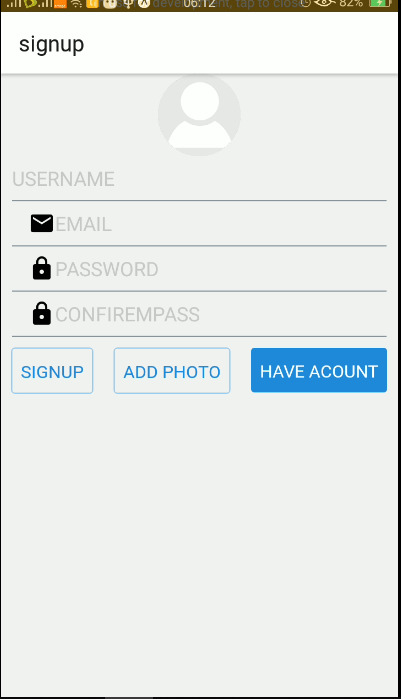
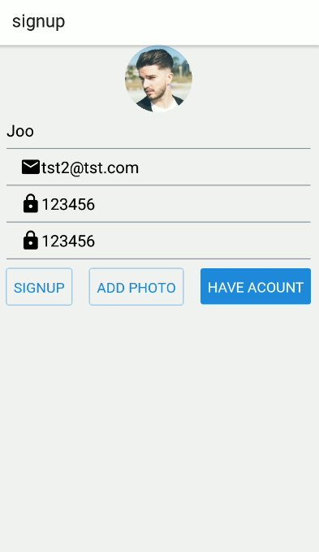
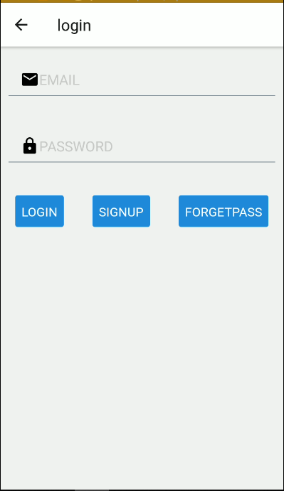
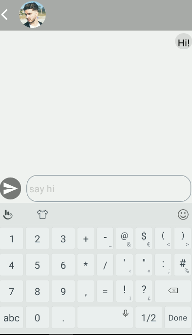
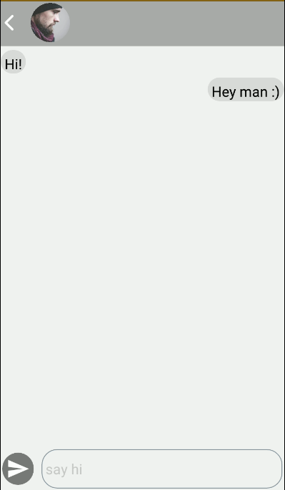

Description: 
    Chatapp is app for make a conversations between shared users and in the backend using <a href= "https://console.firebase.google.com">firebase</a>(firestore - storage - Authentication)  
___________________________________________________________________________  
Features:  
    make make a conversations with any user in the app with (push and send) notifications and upload profile image.
    (android - ios) os  
___________________________________________________________________________  
Getting Started : 
    1- clone the repo  
    2- insert in cmd or shell (npm install) 
    3- npm start or (expo start) 

___________________________________________________________________________  
Screenshots:
     
    
     
    
     
    
     
    
     
    
      
    
     
    
     
    ________________________________________________________________________  
    Libraries: 
        1- <a href="https://react-native-elements.github.io/react-native-elements/">React native-elements</a> 
        2- <a href="https://redux.js.org/">Redux</a> 
            .redux  
            .react-redux 
            .thunk 
        3- <a href="https://reactnavigation.org/">React Navigation</a> 
    ________________________________________________________________________  
    Developer :  
        emad hashem 
